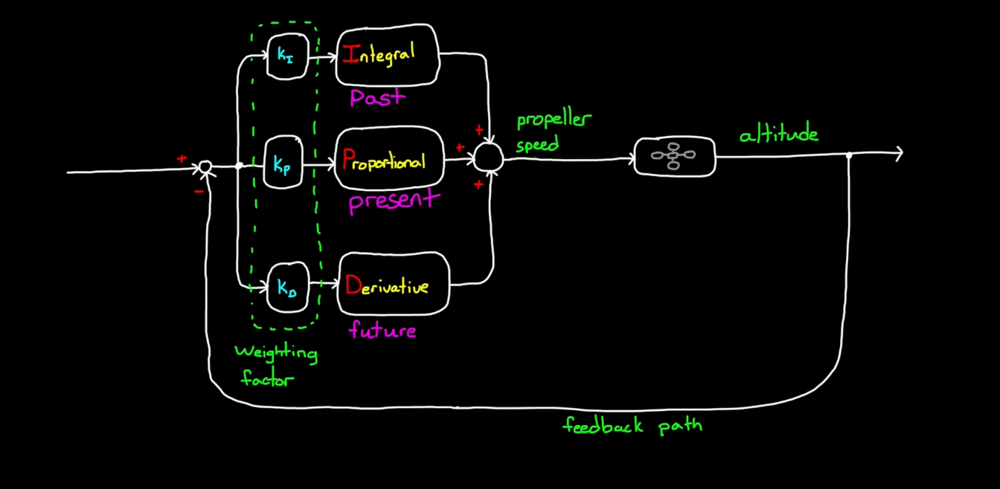
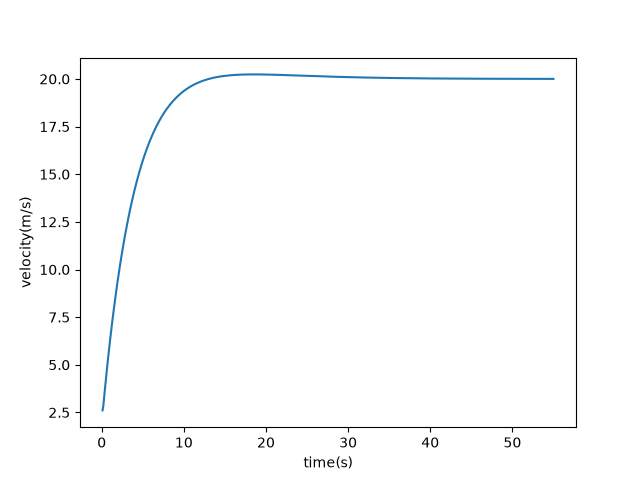
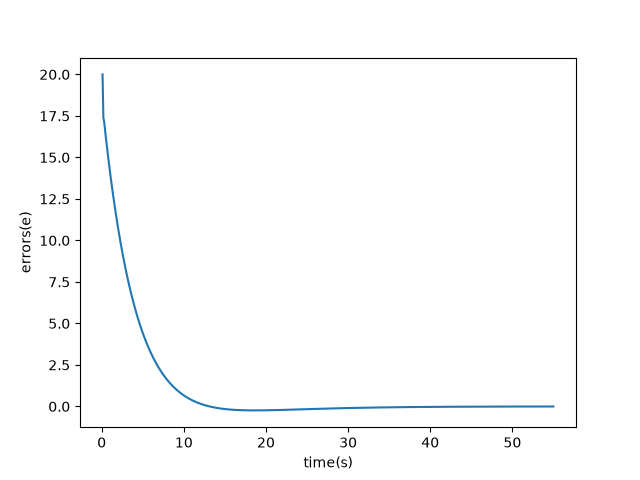

# Software Onboarding Projects - Fall 2026 (fs-5 design cycle)

## PID Controller Using Python/PyTorch for Minimizing Longitudinal Error

This project displays the basic implementation of a P.I.D. controller, which focuses on maintaining longitudinal control of the car. The controller converts the `error term`, the difference between the `controlled variable` and `commanded variable`, into suitable actuator commands so that over time the error is driven to `0`. In this scenario, the P.I.D. controller is to ensure that the car's velocity converges toward a desired velocity. 

The PID controller uses 3 tuned constants in order to do so: 

1. `Proportional Gain` - Utilizes the error at the present moment to determine the required corrective response. The greater the current error is, the greater the corrective response becomes. The proportional gain responds with less intensity as the `controlled variable` approaches the `commanded variable`.

2. `Integral Gain` - Sums up the input total over time, so it has memory of what has happened before. The integrator path will continue to display activation so long as `steady state error` exists within the system. Initially, when the system achieves the target and continues to move past it, this is called `overshoot`, which lowers the output of the integrator.

3. `Derivative Gain` - Produces a measure of the rate of change of the error. Uses the rate of change of the error term to determine how fast the `controlled variable` is approaching the `commanded variable`. It can prematurely lower the strength of actuators in order to mitigate `overshoot`.

## P.I.D. Controller Diagram

For more information: https://www.mathworks.com/discovery/pid-control.html

## P.I.D. Controller Installation & Implementation

1. Clone the repository with the following command: git clone https://github.com/zvx1s/fs-5-software-intro-projects.git
2. Install numpy: https://numpy.org/install/
3. Install matplotlib: https://matplotlib.org/stable/install/index.html
4. Install PyTorch: https://pytorch.org/get-started/locally/
5. Run the following files respectively: `pid_template.py`, `run_template.py`, `run_template_copy.py`

## P.I.D. Tuning and Observations

| P.I.D. Tuning Figure 1 | P.I.D. Tuning Figure 2 |
| :---: | :---: |
|  |  |

As I was tuning the derivative term `K_D` and the desired velocity `car["desired_v"]`, I noticed that there was an initial oscillation that took place at the beginning of both graphs. This oscillation is a well-known phenomenon called the `derivative kick`, and it occurs because the derivative term `K_D` becomes increasingly sensitive to a sudden change in the `error term`. Because the discrepency between the desired velocity and the current velocity became increasingly larger as I implemented higher values for `car["desired_v"]`, the proportional gain rapidly increased in strength, causing the `error` term to shrink rapidly. Additionally, in the implementation of the increased `car["desired_v"]`, the stored `car["prev_error"]` jumped from `0` to a very large initial error. The `derivative kick` is also known as the `transient`, which describes the temporary behavior that a system displays after the system changes in some way. This often happens before the system settles into its long-term behavior.

Observations:

- At `20 m/s`, the controller converged smoothly toward `car["desired_v"]` with minor `overshoot` at the following values for each of the three terms: `K_P` = `0.4`, `K_I` = `0.035`, `K_D` = `0.1`

- At `100 m/s`, the controller converged with greater `overshoot` beforehand. This was due to a greater initial error `error["prev_error"]`, which caused the proportional gain to rapidly increase in strength.

- Increasing the derivative gain reduced the `overshoot`, but it also made the startup `transient`, a.k.a. the `derivative kick` far greater as a result.

## Known Issues (Work In Progress)

This project is still ongoing, as the linear regression model in PyTorch, specifically the matrix multiplication between the `X` and `y` tensors still needs to be completed.

## Works Cited

- Bourke, Daniel. “01. PyTorch Workflow Fundamentals - Zero to Mastery Learn Pytorch for Deep Learning.” 01. PyTorch Workflow Fundamentals - Zero to Mastery Learn PyTorch for Deep Learning, www.learnpytorch.io/01_pytorch_workflow/. Accessed 7 Oct. 2026.

- Contributors, PyTorch. “Pytorch Documentation.” PyTorch Documentation - PyTorch 2.14 Documentation, 1 Jan. 2023, docs.pytorch.org/docs/2.14/index.html.

- Mejbah Ahammad. “PyTorch Day 04: Indexing, Slicing, and Joining Tensors.” DEV Community, 16 Jan. 2025, https://dev.to/ahammadmejbah/pytorch-day-04-indexing-slicing-and-joining-tensors-7kl. Accessed 8 Oct. 2026.

-
-
-
-
-
-
-
-
-
-
-
### Special thanks to Dylan for guiding me. Wouldn't have made it this far without him.

